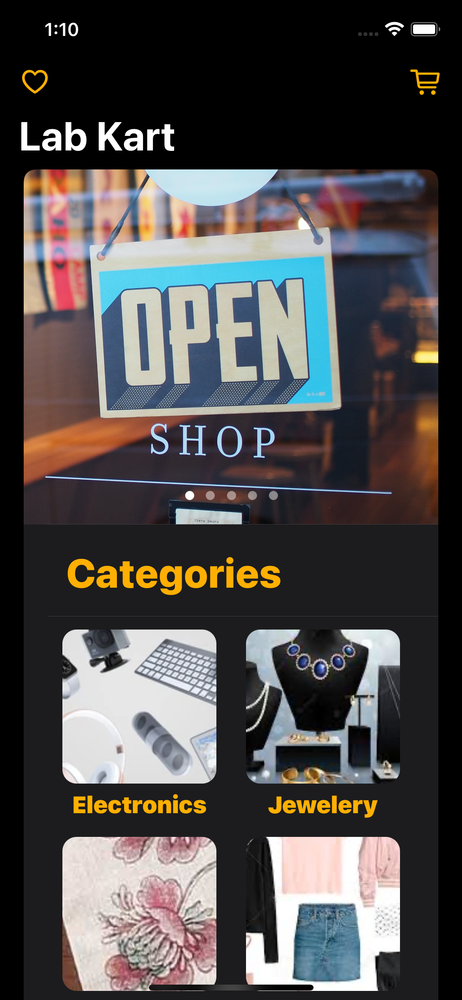
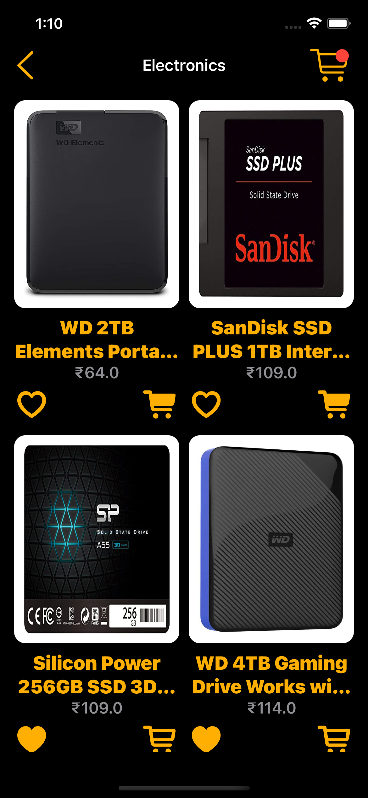
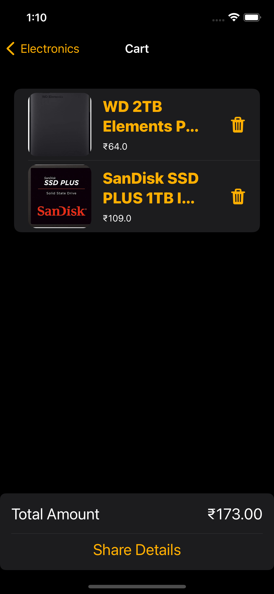
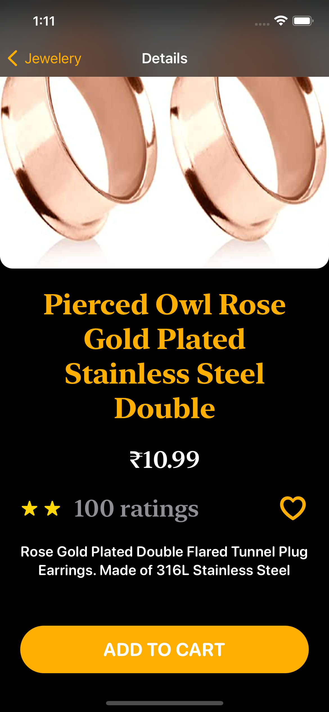
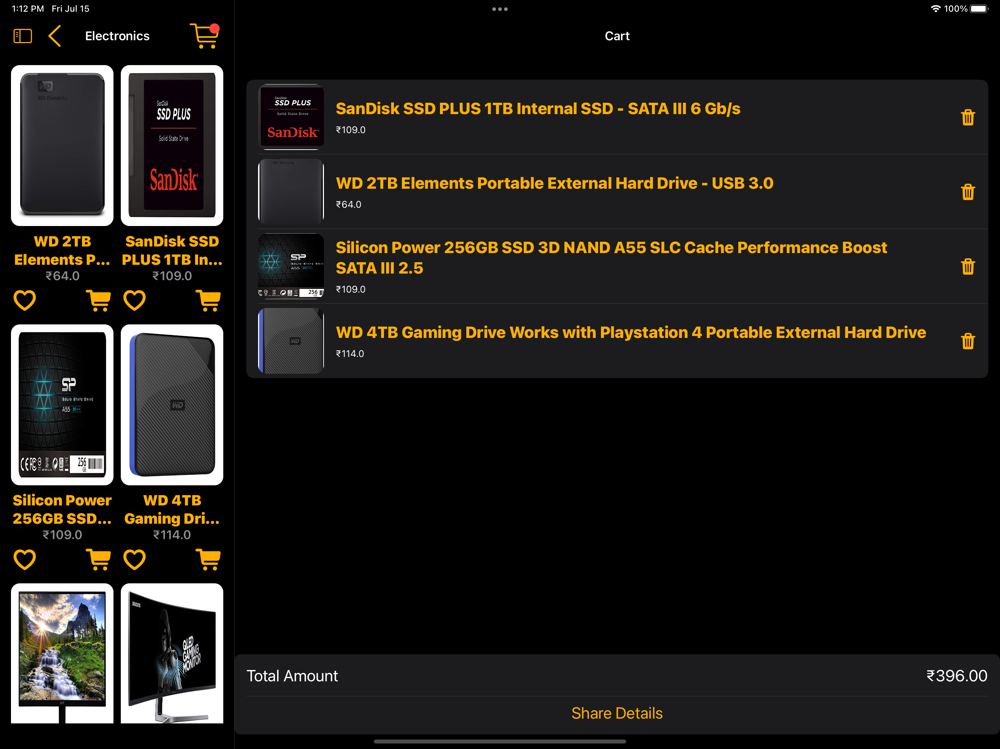

# LabKart_SwiftUI

---

<h2> 
  Full featured eCommerce like app written in SwiftUI with MVVM architecture.
</h2>

  
  
  
  

  
  
  

---

<h2>
  Features
</h2>

- Home Page with categories of products like Electronics, Men, Women, Baby & Kids etc.
- Product List page will display product thumbnail, price, product name, icons to add product to cart and icon to wish list.
- Product details page will display the description of the product along with images. User can add the product to Cart.
- Wish List Page. User can add the product to cart.
- Cart will show the products added. User can share the details in this page via static Link

---

<h2>
  Notes
</h2>

 Use of JSON data stored locally to get product details.

---

<h2>
  Watch Full Video
</h2>

<a href="https://drive.google.com/file/d/1q4Z9Wil4ejB06biKiaQjufwXQcV3BQTV/view?usp=drivesdk"> Click here to Watch the full Functionality. </a>

---
